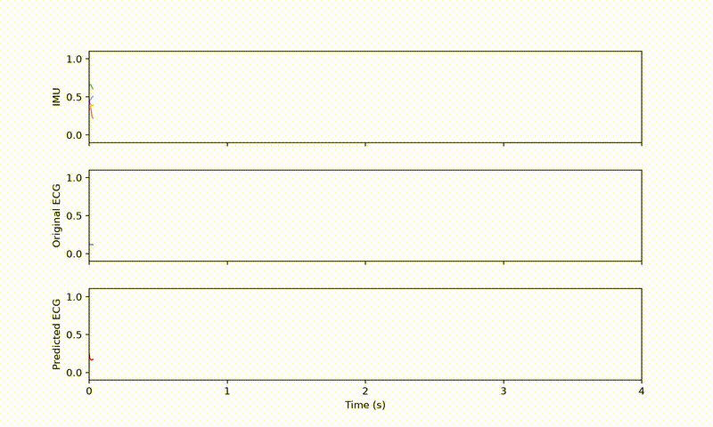

# TinyCardioUNet: IMU-to-ECG Translation with Graph-Encoded Inter-Axis Dependencies and Tensor Decomposition-Based Parameter Reduction



[](https://arxiv.org/abs/2609.29322)   [](https://ieee-dataport.org/documents/mechanocardiograms-ecg-reference) [](LICENSE)

Official implementation of TinyCardioUNet, a lightweight 1D U-Net that reconstructs single-lead ECG from a 6-axis chest-worn IMU (3-axis accelerometer for seismocardiography, 3-axis gyroscope for gyrocardiography). A GraphSAGE module in the bottleneck encodes the physical dependencies between accelerometer and gyroscope axes as a graph. To compress the model for on-device use, tensor decomposition (TD) is applied: convolutional layers are factorized with Tucker-2 decomposition and linear layers with truncated SVD. The TD ranks are selected automatically with variational Bayesian matrix factorization (VBMF), and the compressed model is then fine-tuned to recover accuracy.

## File structure
```
.
├── TinyCardioUNet
│   ├── graph.py                     # IMU inter-axis graph configuration
│   └── model.py                     # TinyCardioUNet architecture
├── src
│   └── vbmf.py                      # VBMF
├── weights                          # Pretrained weights
│   ├── tinycardiounet_base.pt                       # Base (uncompressed) model
│   └── tinycardiounet_compressed_finetuned_ep10.pt  # TD + fine-tuned model
├── Image
│   └── output.gif                   # Inference demo
├── decompose_tinycardiounet_vbmf.py # Tucker-2 / SVD with VBMF ranks
├── main.py                          # Inference example
├── pyproject.toml                   # Required packages
└── README.md
```


## Installation

1. Clone this repository:
```bash
git clone https://github.com/ttlabtuat/TinyCardioUNet.git
cd TinyCardioUNet
```

2. Install the required packages.
```bash
uv sync
```

## Usage
```python
import numpy as np
import torch
from floppy import FLOPpyTracker
from torchinfo import summary
from TinyCardioUNet.model import TinyCardioUNet
from decompose_tinycardiounet_vbmf import decompose_tinycardiounet_vbmf

device = 'cuda' if torch.cuda.is_available() else 'cpu'

# 1. Initialize the model architecture and load the base weights
model = TinyCardioUNet(in_channels=6)
model.load_state_dict(torch.load("./weights/tinycardiounet_base.pt", map_location=device))

# 2. Decompose the model (VBMF-based tensor decomposition) and load the compressed weights
decompose_tinycardiounet_vbmf(model, verbose=False)
model.load_state_dict(torch.load("./weights/tinycardiounet_compressed_finetuned_ep10.pt", map_location=device))
model = model.to(device)
model.eval()

# 3. Prepare a dummy IMU signal
# Shape: (batch_size, channels, 256Hz*4s samples)
# A batch of 1 sequence, IMU 6-channels, 1024 samples.
dummy_imu = np.random.rand(1, 6, 1024).astype(np.float32)
dummy_imu = torch.from_numpy(dummy_imu).to(device=device)

# 4. Predict ECG signal
with torch.no_grad():
    predicted_ecg = model(dummy_imu)  # (1, 1, 1024)

# 5. Count parameters (torchinfo) and FLOPs (floppy)
stats = summary(model, input_size=(1, 6, 1024), device=device, verbose=0)

tracker = FLOPpyTracker(run_name="TinyCardioUNet")
tracker.run(model=model)
with torch.no_grad():
    model(dummy_imu)
tracker.stop()
flops = tracker.report().model_forward_flop
```

## Datasets
The dataset used for model training can be found on IEEE Dataport. (Login and subscription required.)

- [Mechanocardiograms with ECG reference](https://ieee-dataport.org/documents/mechanocardiograms-ecg-reference)

## Contact Us
This repository was published through the official TTLAB account, and the issues and pull requests tab has been disabled. If you encounter any error while model inference, please reach out to the code author below:

- Seungwoo Han (han@sip.tuat.ac.jp)

## Citation
If you use this work useful, please citing our paper:

```bibtex
@article{TinyCardioUNet,
  doi = {10.48550/arXiv.2609.29322},
  author = {Han,  Seungwoo and Chanpornpakdi,  Ingon and Noda,  Motoi and Leelasiri,  Puwadej and Hiruma,  Ibuki and Tanaka,  Toshihisa},
  title = {TinyCardioUNet: IMU-to-ECG Translation with Graph-Encoded Inter-Axis Dependencies and Tensor Decomposition-Based Parameter Reduction},
  publisher = {arXiv},
  year = {2026},
}
```